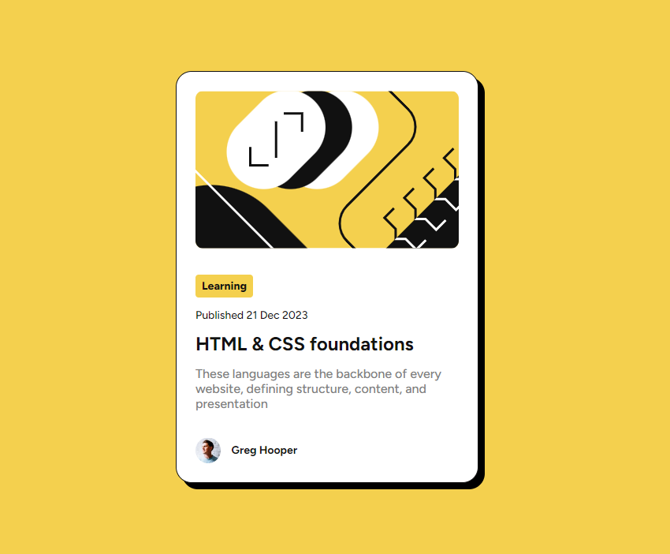

# Frontend Mentor - Blog preview card solution

This is a solution to the [Blog preview card challenge on Frontend Mentor](https://www.frontendmentor.io/challenges/blog-preview-card-ckPaj01IcS). Frontend Mentor challenges help you improve your coding skills by building realistic projects.

## Table of contents

- [Frontend Mentor - Blog preview card solution](#frontend-mentor---blog-preview-card-solution)
  - [Table of contents](#table-of-contents)
  - [Overview](#overview)
    - [The challenge](#the-challenge)
    - [Links](#links)
  - [My process](#my-process)
    - [Built with](#built-with)
    - [What I learned](#what-i-learned)
    - [Continued development](#continued-development)
  - [Author](#author)

## Overview

### The challenge

Users should be able to:

- See hover and focus states for all interactive elements on the page

### Links

- Solution URL: [Add solution URL here](https://your-solution-url.com)
- Live Site URL: [Live Site](https://rahexx.github.io/BlogPreviewCardFM/)

## My process

### Built with

- HTML
- SCSS
- Flexbox
- Mobile-first workflow

### What I learned

I could learn scss variables again.

### Continued development

I hope in the future makre challanges using react, next.js, vue, angulara, typescripta.

## Author

- Frontend Mentor - [@Rahexx](https://www.frontendmentor.io/profile/Rahexx)
